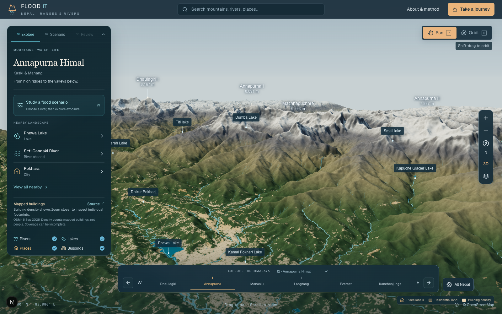
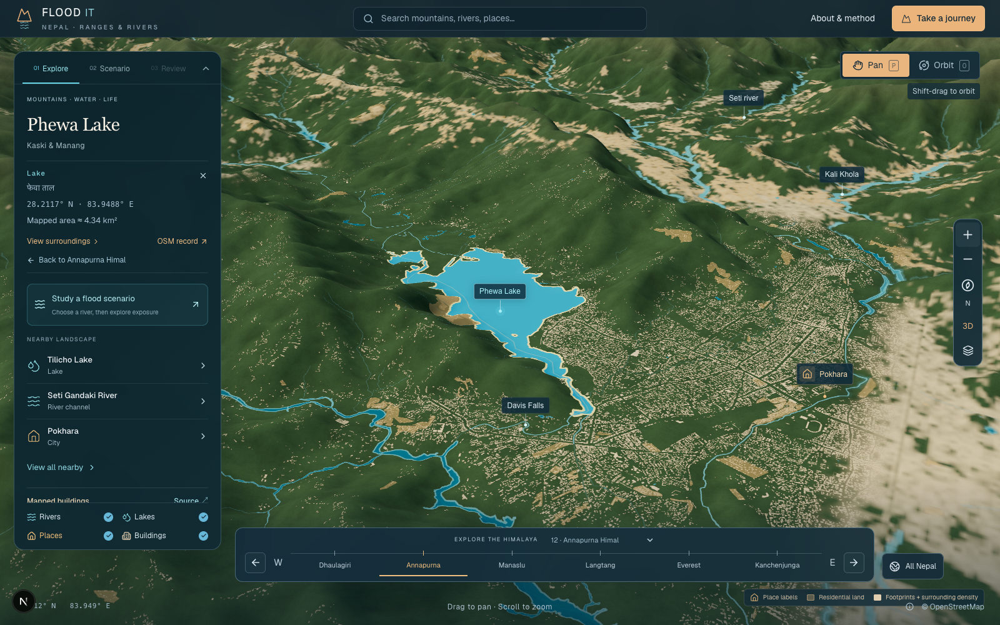

# Building coverage remediation

Phewa Lake's developed eastern shore looked almost empty because the atlas imported named place nodes and `landuse=residential`, but omitted `building=*` polygons. Making the house markers larger could not correct that omission.

This change adds a separate building layer across the Nepal extract. Regional views show building density; a local detail window reveals original footprints as the camera approaches. Water and land-use geometry are drawn at the same local texture resolution, so coarse shoreline pixels cannot cover lakeside buildings. House icons remain on named place labels only. Density is blended into footprints at the detail-window edge; it remains visible outside that window.





## Source and precision

- OpenStreetMap contributors / Geofabrik Nepal, **2026-09-06T20:21:35Z**, ODbL 1.0.
- Source PBF SHA-256: `303bcc820584c82438644dd6425243a533c526748cc3c4d4dc27e49da32bca9c`.
- **8,286,549** source building records, 4,519 footprint tiles, 81 density images. Three areas could not be assembled by pyosmium and are recorded as `RuntimeError` omissions in the manifest. No claim of exhaustive real-world coverage is made.
- Footprint vertices retain seven decimal places, including interior rings. No heights, occupancy or population are invented. Separate source IDs may describe overlapping physical structures.
- `building=yes` is unspecified. Other `building` values describe mapped architectural type, not necessarily current use. See the [OSM building definition](https://wiki.openstreetmap.org/wiki/Key:building) and [residential land-use definition](https://wiki.openstreetmap.org/wiki/Tag:landuse%3Dresidential).
- Each density image is a 1024 × 1024 grid over 0.5°. One representative point per source record contributes to an approximately 50 m cell. Alpha is `min(235, 90 + 45 * log2(count))` for occupied cells. It represents mapped-building count density, not built-surface fraction or population.

## Independent Phewa comparison

The preceding direct-PBF audit covered 83.914–84.012° E, 28.185–28.252° N. It found **57,377** building polygons; every audited geometry is retained by this import, checked within 1e-8 degrees. All 99 residential land-use records in that audit were already present in the old display.

The shoreline check uses a 500 m outward buffer of Phewa Lake (`relation/8202581`) in UTM 44N, excluding the lake. It selects building representative points inside that band:

| Source feature | Count |
| --- | ---: |
| Building polygons | 4,549 |
| Existing place markers | 4 |
| Buildings outside imported residential land | 4,356 (95.8%) |

The independently selected IDs are preserved in `scripts/fixtures/phewa-shore-building-ids.json`. `npm test` verifies that every ID is recoverable through the production building loader. These are source-data consistency checks, not field validation.

## Loading and interaction

Footprint tiles span 0.05° and duplicate crossing geometry to every intersected tile; the client deduplicates by OSM ID. Detail requests are restricted to at most 16 tiles and 250,000 source records. A 12-entry source cache bounds retained tile data. Country views do not request nationwide footprints. Density images decode four at a time and are closed after composition.

Failed listed tiles are reported as missing coverage, with retry; they never become empty neighbourhoods. Stale responses cannot replace a newer view or update a disposed scene. Footprint picking respects holes. Layer loading never changes the camera position or orbit target.

The static footprint payload totals 284.1 MiB compressed, with a largest individual tile of 3.32 MiB. These files are lazy-loaded assets, not part of the JavaScript bundle. The manifest lists counts, sizes and decoded-payload SHA-256 checksums; all 4,519 checksums were verified during remediation. The adapted database and attribution are downloadable at `/buildings/data.html`.

## Flood assessment scope

**Individual buildings are not assessed by this change.** The current model intersects hypothetical inundation with mapped residential land. Buildings outside those polygons remain absent from residential exposure totals. A pale footprint or blank area is not evidence of safety.

This distinction is included in the scenario panel, map legend, footprint inspector, method page, JSON report and snapshot. Building-level exposure requires a separate extension of the assessment and validation; this PR corrects the settlement visualization without relabelling land-use results as building risk.

## Reproduce

Use Python 3.11+ with `osmium`, `shapely`, `numpy`, and `pillow`. Supply the PBF and matching `.poly` extraction boundary together. For exact reproducibility, use the snapshot hash above rather than the moving latest download.

```sh
python scripts/import-buildings.py /path/to/nepal.osm.pbf /path/to/temporary-building-import
npm test
npm run lint
npx tsc --noEmit
npm run build
```

The importer keeps temporary tile spools outside the repository; they are not published. Automated tests cover the independent shoreline fixture, density totals, courtyard transparency and picking, boundary deduplication, missing-tile recovery, request bounds, stale results and disposal. The existing flood and river-camera regression suites also run.

Browser verification covered the Three.js regional view, Phewa footprint window, independent layer toggle, a footprint resolving to OSM `way/403847308`, and the mobile layout at 390 × 844 with no horizontal overflow.
